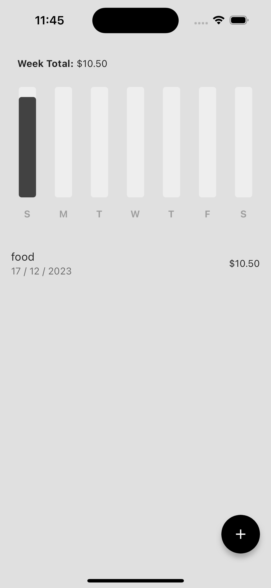
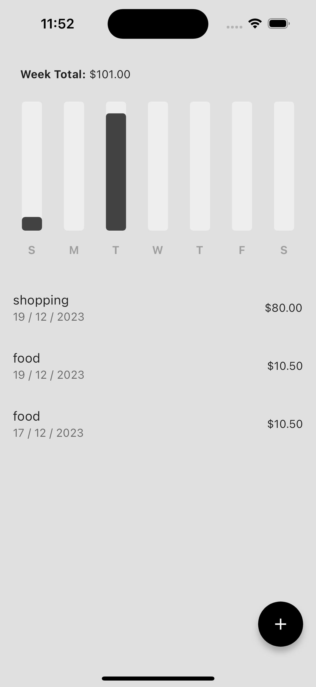

# Expense Tracker App using Flutter

Created an App using Flutter and Dart where User can add Expenses with Category and amount and it gets Shown in Bar Graph as a Weekly Summery.

## Setup

Run the following commands from your terminal:

1) `git clone https://github.com/quibler7/Expense-Tracker-App-using-Flutter` to clone this repository 

2) `flutter pub get` in the project root directory to install all the required dependencies.

## Screenshots 

